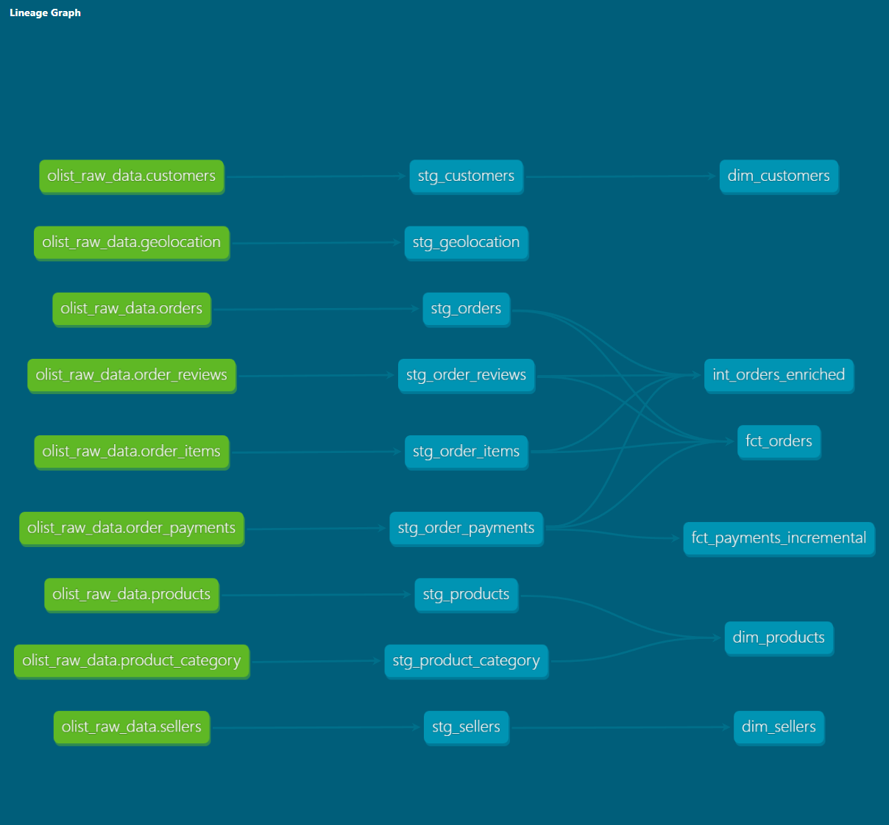

# Olist Analytics Engineering Project (dbt + BigQuery)

## Overview

This project demonstrates an end-to-end **Analytics Engineering workflow** using the public **Olist e-commerce dataset**.
The goal of the project is to transform raw operational data into a **clean analytical data model** using **dbt and BigQuery**.

The project follows a typical modern data stack approach:

Raw Data → Staging → Intermediate → Data Marts (Dimensions & Facts)

This repository shows how raw data can be transformed into a structured **star schema** that is ready for analytics and BI dashboards.

---

## Tech Stack

* **dbt** – data transformation and modeling
* **Google BigQuery** – data warehouse
* **SQL** – transformations
* **dbt tests** – data quality checks
* **GitHub** – version control

---

## Dataset

Source: Olist Brazilian E-commerce Public Dataset

The dataset contains information about:

* orders
* customers
* sellers
* products
* order items
* payments
* reviews
* geolocation

These tables were loaded into **BigQuery** as raw tables.

---

## Project Structure

The project follows a layered dbt structure.

models/

* staging/
* intermediate/
* marts/

### Staging Layer

The staging layer cleans and standardizes the raw data.

Typical tasks in this layer:

* rename columns
* basic type casting
* remove duplicates
* apply initial data quality tests

Example models:

* `stg_orders`
* `stg_order_items`
* `stg_products`
* `stg_customers`
* `stg_order_payments`
* `stg_order_reviews`

---

### Intermediate Layer

This layer performs transformations that combine multiple staging tables.

Example:
`int_orders_enriched`

This model joins orders with payments and order items to calculate aggregated metrics such as:

* total order value
* total payment amount

---

### Marts Layer

The marts layer contains the final **analytics-ready tables**.

These tables follow a **star schema design**.

Dimensions:

* `dim_customers`
* `dim_products`
* `dim_sellers`

Fact tables:

* `fct_orders`

The grain of `fct_orders` is:

1 row = 1 order

Example columns:

* order_id
* customer_id
* order_status
* order_date
* total_order_value
* total_payment

---

## Data Lineage

dbt automatically generates data lineage based on `ref()` and `source()` relationships.

Example flow:

Raw Sources
↓
Staging Models
↓
Intermediate Models
↓
Dimension & Fact Tables

This helps track where data comes from and makes debugging easier.

To view lineage locally:

dbt docs generate
dbt docs serve

Then open:
http://localhost:8080

---

## Data Quality Tests

dbt tests were added to ensure data quality.

Examples:

* `not_null`
* `unique`
* `accepted_values`
* relationship tests

Example checks:

* `order_id` must be unique in fact tables
* `customer_id` must exist in the customers dimension
* payment values must be positive

These tests help detect issues early during transformations.

---

## Key Design Decisions

### Fact Table Grain

The main fact table (`fct_orders`) is designed at **order level**.

This prevents duplicate rows caused by joining order items or payments directly.

### Aggregations

Order items and payments are aggregated before joining to the fact table.

This ensures:

1 order = 1 row

### Handling Missing Data

Some product categories were missing in the raw dataset.
Missing values were replaced with `"unknown"` to pass data quality checks.

---

## How to Run the Project

Install dependencies:

dbt deps

Run transformations:

dbt run

Run tests:

dbt test

Generate documentation:

dbt docs generate
dbt docs serve

---

## Possible Improvements

This project can be improved in several ways:

### Incremental Models

Large tables such as payments could be built using incremental models to improve performance.

### Partitioning and Clustering

BigQuery tables could use partitioning on `order_date` and clustering on keys such as `customer_id`.

### Metrics Layer

Business metrics such as:

* Total Revenue
* Average Order Value
* Monthly Orders

can be defined for BI tools.

### BI Dashboard

The marts layer can be connected to a dashboard tool such as:

* Looker Studio
* Power BI
* Metabase

---
## Data Lineage

The lineage below shows how data flows from raw sources to marts:

## Lessons Learned

Working on this project helped reinforce several analytics engineering concepts:

* designing data models with clear grain
* avoiding duplicates caused by joins
* structuring dbt projects into layers
* using data tests to enforce quality
* understanding how lineage helps trace data issues

It also highlighted how important it is to align **tests with the actual model structure**. Many early errors were caused by tests referencing columns that no longer existed after aggregation.

---

## Final Thoughts

This project demonstrates a simplified but realistic **analytics engineering workflow** using dbt and BigQuery.

The goal was not only to build models but also to practice:

* data modeling
* testing
* documentation
* project structure

These are essential skills for modern **Analytics Engineers and Data Engineers**.

---
